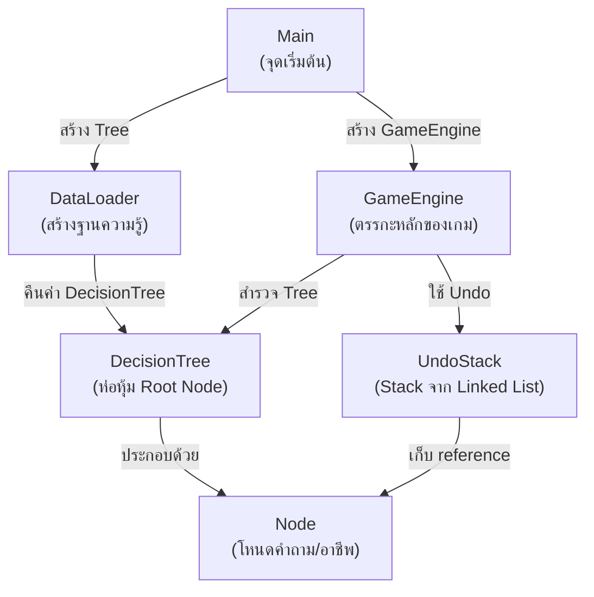
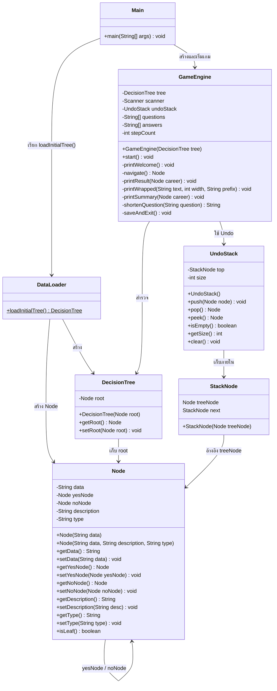
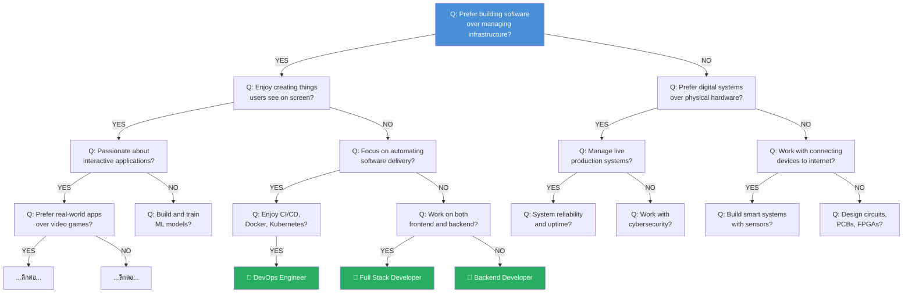
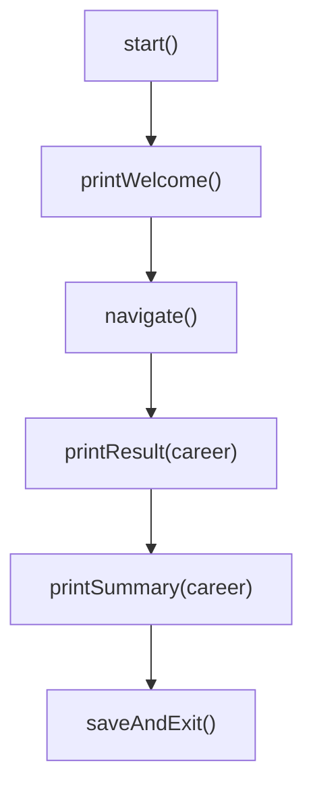
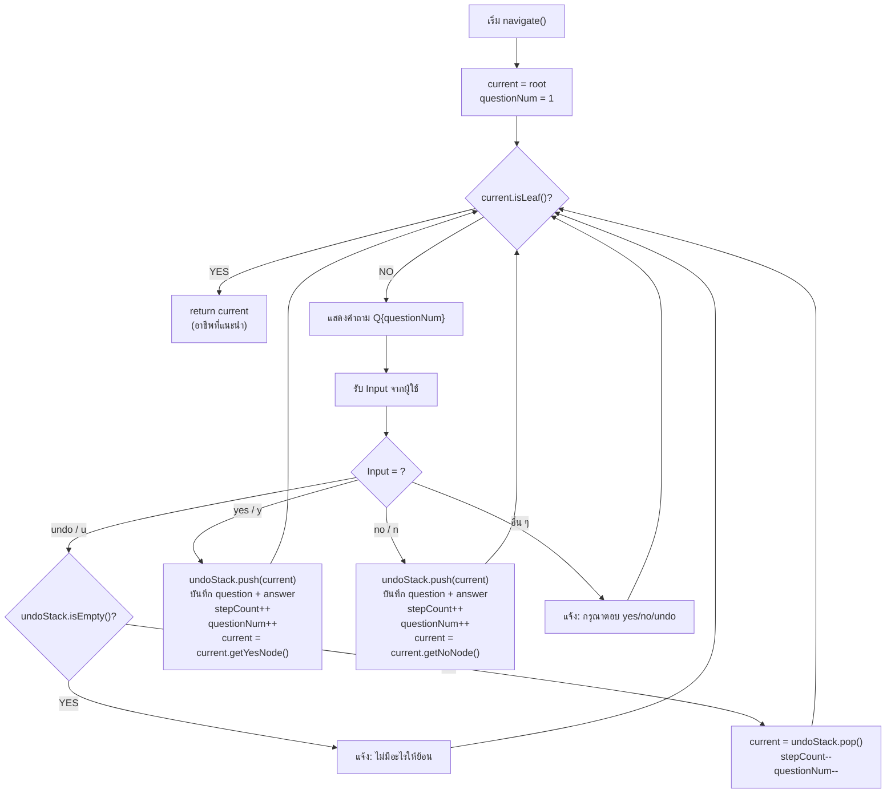

# รายงาน Term Project

# วิชา CPE 121 Data Structure and Algorithm

---

<div align="center">

# **The Career Path Oracle**
### **ระบบแนะนำเส้นทางอาชีพสายเทคโนโลยี**

---

**ภาคการศึกษาที่ 1 ปีการศึกษา 2568**

**มหาวิทยาลัยเทคโนโลยีพระจอมเกล้าธนบุรี**

---

### คณะผู้จัดทำ

| ลำดับ | ชื่อ – นามสกุล | รหัสนักศึกษา |
|:---:|:---|:---:|
| 1 | นางสาวฑิตยา สายยนต์ | 68070501010 |
| 2 | นายณภัทร ศรีสวัสดิ์ | 68070501012 |
| 3 | นางสาวบัวบุษกร เจริญธรรม | 68070501027 |
| 4 | นางสาวเปี่ยมสิริ เกษมสมใจ | 68070501031 |
| 5 | นายเฟ้นพิชญ์ จีระ | 68070501037 |

### อาจารย์ที่ปรึกษา

อาจารย์ปิยนิตย์ เอื้ออารีมิตร

อาจารย์ทวีชัย นันทวิสุทธิวงศ์

</div>

---

<div style="page-break-after: always;"></div>

## สารบัญ

1. [บทนำ](#1-บทนำ)
   - 1.1 ความเป็นมาและความสำคัญ
   - 1.2 วัตถุประสงค์
   - 1.3 ขอบเขตของโปรแกรม
   - 1.4 ประโยชน์ที่คาดว่าจะได้รับ
   - 1.5 หน้าที่ของสมาชิกในกลุ่ม
2. [วิธีการดำเนินงาน](#2-วิธีการดำเนินงาน)
   - 2.1 โครงสร้างข้อมูลที่ใช้ในโปรแกรม
   - 2.2 การออกแบบและสถาปัตยกรรมของระบบ
   - 2.3 รายละเอียดการทำงานของแต่ละคลาสและฟังก์ชัน
   - 2.4 การวิเคราะห์ Time Complexity และ Space Complexity
   - 2.5 วิธีการใช้งานโปรแกรม
   - 2.6 การทดสอบการทำงานของโปรแกรม
3. [สรุปผลการดำเนินงาน](#3-สรุปผลการดำเนินงาน)
   - 3.1 ผลลัพธ์ที่ได้
   - 3.2 ปัญหาและอุปสรรค
   - 3.3 ข้อเสนอแนะในการพัฒนาต่อ
4. [บรรณานุกรม](#4-บรรณานุกรม)
5. [ภาคผนวก](#5-ภาคผนวก)

---

<div style="page-break-after: always;"></div>

## 1. บทนำ

### 1.1 ความเป็นมาและความสำคัญ

ในปัจจุบันอุตสาหกรรมเทคโนโลยีสารสนเทศมีการเติบโตอย่างรวดเร็ว ส่งผลให้เกิดสายอาชีพที่หลากหลาย ไม่ว่าจะเป็นนักพัฒนาซอฟต์แวร์ (Software Developer) วิศวกรข้อมูล (Data Engineer) ผู้เชี่ยวชาญด้านความมั่นคงปลอดภัยไซเบอร์ (Cybersecurity Engineer) หรือวิศวกรระบบสมองกลฝังตัว (Embedded Systems Engineer) ทำให้นักศึกษาหรือผู้ที่สนใจเข้าสู่วงการเทคโนโลยีมักเกิดความสับสนในการเลือกเส้นทางอาชีพที่เหมาะสมกับความถนัดและความสนใจของตนเอง

คณะผู้จัดทำจึงพัฒนาโปรแกรม **"The Career Path Oracle"** ขึ้นเพื่อเป็นเครื่องมือแนะนำเส้นทางอาชีพสายเทคโนโลยีผ่านการตอบคำถาม Yes/No เป็นลำดับขั้น โดยอาศัยโครงสร้างข้อมูล **Binary Decision Tree** เป็นแกนหลักในการจำแนกความสนใจของผู้ใช้ออกเป็นกลุ่มอาชีพที่เฉพาะเจาะจงยิ่งขึ้นในแต่ละระดับ ครอบคลุมอาชีพสายเทคโนโลยีจำนวน 20 อาชีพ ใน 4 กลุ่มหลัก ได้แก่ กลุ่มพัฒนาซอฟต์แวร์ กลุ่มข้อมูลและปัญญาประดิษฐ์ กลุ่มโครงสร้างพื้นฐานดิจิทัล และกลุ่มฮาร์ดแวร์และระบบสมองกลฝังตัว

นอกจากนี้ โปรเจกต์นี้ยังเปิดโอกาสให้คณะผู้จัดทำได้ประยุกต์ใช้ความรู้ในวิชา Data Structure and Algorithm โดยนำโครงสร้างข้อมูลประเภทต่าง ๆ ที่ได้เรียนมาใช้งานจริง ได้แก่ Binary Tree, Linked List, Stack และ Array ตลอดจนฝึกฝนการออกแบบอัลกอริทึมในการสำรวจต้นไม้ (Tree Traversal) ให้มีประสิทธิภาพเหมาะสมกับปัญหาที่กำหนด

### 1.2 วัตถุประสงค์

1. เพื่อพัฒนาโปรแกรมแนะนำเส้นทางอาชีพสายเทคโนโลยีที่สามารถใช้งานได้จริงผ่าน Command-Line Interface (CLI)
2. เพื่อประยุกต์ใช้โครงสร้างข้อมูล Binary Decision Tree ในการจัดเก็บและจำแนกข้อมูลอาชีพตามเงื่อนไข
3. เพื่อนำโครงสร้างข้อมูล Stack ที่สร้างขึ้นเองจาก Linked List มาใช้สนับสนุนฟังก์ชันการย้อนกลับ (Undo)
4. เพื่อศึกษาและฝึกฝนการวิเคราะห์ Time Complexity และ Space Complexity ของอัลกอริทึมที่ใช้ในโปรแกรม

### 1.3 ขอบเขตของโปรแกรม

- โปรแกรมพัฒนาด้วยภาษา **Java** ทำงานบน Command-Line Interface (CLI)
- รองรับอาชีพสายเทคโนโลยีจำนวน **20 อาชีพ** ที่ถูกจัดเก็บในโครงสร้าง Binary Decision Tree ที่มีความลึก 4–8 ระดับ
- ผู้ใช้ตอบคำถามแบบ Yes/No เป็นลำดับขั้น เพื่อให้ระบบจำแนกไปสู่อาชีพที่เหมาะสม
- รองรับฟีเจอร์ย้อนกลับ (Undo) ให้ผู้ใช้แก้ไขคำตอบก่อนหน้าได้
- แสดงผลลัพธ์อาชีพที่แนะนำพร้อมคำอธิบาย และสรุปลำดับคำตอบทั้งหมด
- ฐานความรู้อาชีพถูกกำหนดไว้ในโค้ด (Hard-coded) ยังไม่รองรับการโหลดจากไฟล์ภายนอก

### 1.4 ประโยชน์ที่คาดว่าจะได้รับ

1. ผู้ใช้สามารถค้นพบเส้นทางอาชีพสายเทคโนโลยีที่ตรงกับความสนใจของตนเองในเบื้องต้น
2. คณะผู้จัดทำได้เรียนรู้การนำโครงสร้างข้อมูลและอัลกอริทึมมาประยุกต์ใช้แก้ปัญหาจริง
3. เป็นแนวทางในการพัฒนาระบบผู้เชี่ยวชาญ (Expert System) แบบง่ายที่สามารถต่อยอดได้ในอนาคต

### 1.5 หน้าที่ของสมาชิกในกลุ่ม

| สมาชิก | หน้าที่ |
|:---|:---|
| นางสาวฑิตยา สายยนต์ | *(เว้นไว้เพื่อเติมภายหลัง)* |
| นายณภัทร ศรีสวัสดิ์ | *(เว้นไว้เพื่อเติมภายหลัง)* |
| นางสาวบัวบุษกร เจริญธรรม | *(เว้นไว้เพื่อเติมภายหลัง)* |
| นางสาวเปี่ยมสิริ เกษมสมใจ | *(เว้นไว้เพื่อเติมภายหลัง)* |
| นายเฟ้นพิชญ์ จีระ | *(เว้นไว้เพื่อเติมภายหลัง)* |

---

<div style="page-break-after: always;"></div>

## 2. วิธีการดำเนินงาน

### 2.1 โครงสร้างข้อมูลที่ใช้ในโปรแกรม

โปรแกรม The Career Path Oracle ใช้โครงสร้างข้อมูลทั้งหมด 4 ประเภท แต่ละประเภทถูกเลือกใช้ตามความเหมาะสมของบทบาทในระบบ ดังนี้

---

#### 2.1.1 Binary Decision Tree (โครงสร้างหลัก)

**บทบาท:** จัดเก็บคำถามและอาชีพทั้ง 20 รายการในรูปแบบโครงสร้างต้นไม้ทวิภาค โดยแต่ละโหนดภายใน (Internal Node) เก็บคำถาม Yes/No และแต่ละโหนดใบ (Leaf Node) เก็บข้อมูลอาชีพที่เป็นผลลัพธ์

**เหตุผลที่เลือกใช้:**

- **เหมาะสมกับการตัดสินใจแบบแบ่งสอง (Binary Classification):** ในแต่ละขั้นตอน ผู้ใช้มีทางเลือกเพียง 2 ทาง (Yes/No) ซึ่งสอดคล้องกับธรรมชาติของ Binary Tree ที่มีลูก 2 ฝั่ง (yesNode, noNode)
- **จำแนกอาชีพอย่างเป็นลำดับขั้น:** คำถามในระดับต้น ๆ แบ่งกลุ่มอาชีพเป็นกลุ่มใหญ่ (เช่น ซอฟต์แวร์ vs. ฮาร์ดแวร์) แล้วค่อย ๆ แคบลงจนเจาะจงไปที่อาชีพเฉพาะ เป็นลักษณะของ Divide and Conquer
- **ค้นหาผลลัพธ์ได้อย่างมีประสิทธิภาพ:** ด้วยความลึก 4–8 ระดับ ผู้ใช้ตอบคำถามเพียง 4–8 ข้อก็ได้อาชีพที่แนะนำ ทำให้ Time Complexity คือ **O(h)** โดย h คือความสูงของต้นไม้

**ข้อมูลเชิงปริมาณของ Decision Tree ในโปรแกรม:**

| คุณสมบัติ | ค่า |
|:---|:---|
| จำนวนโหนดทั้งหมด (โดยประมาณ) | 59 โหนด |
| จำนวนโหนดภายใน (คำถาม) | 27 โหนด |
| จำนวนโหนดใบ (อาชีพ) | 32 โหนด |
| อาชีพไม่ซ้ำกัน (Unique Careers) | 20 อาชีพ |
| ความลึกต่ำสุด (Minimum Depth) | 4 |
| ความลึกสูงสุด (Maximum Depth) | 8 |

> [!NOTE]
> จำนวนโหนดใบมากกว่า 20 เนื่องจากอาชีพบางรายการปรากฏซ้ำในหลายเส้นทาง เพื่อให้ผู้ใช้ที่ตอบคำถามต่างกันยังคงสามารถไปถึงอาชีพเดียวกันได้ เช่น "Mobile Developer" สามารถเข้าถึงได้ทั้งจากเส้นทางของผู้ที่สนใจ Web Technologies และผู้ที่ไม่สนใจ

---

#### 2.1.2 Stack (สร้างจาก Linked List — Custom Implementation)

**บทบาท:** รองรับฟีเจอร์ย้อนกลับ (Undo) ให้ผู้ใช้สามารถกลับไปคำถามก่อนหน้าได้

**เหตุผลที่เลือกใช้:**

- **หลักการ LIFO (Last-In, First-Out) เหมาะกับ Undo:** เมื่อผู้ใช้ต้องการย้อนกลับ โหนดคำถามที่ตอบล่าสุดจะถูกดึงออกมาก่อน ซึ่งสอดคล้องกับลำดับการย้อนกลับตามธรรมชาติ
- **สร้างขึ้นเองจาก Linked List (ไม่ใช้ `java.util.Stack`):** เพื่อให้ตรงตามข้อกำหนดของโปรเจกต์ที่ต้องสร้างโครงสร้างข้อมูลเอง ช่วยให้เข้าใจกลไกภายในของ Stack อย่างลึกซึ้ง
- **ขนาดยืดหยุ่น:** ไม่จำเป็นต้องกำหนดขนาดล่วงหน้า เนื่องจากใช้ Linked List ซึ่งจองหน่วยความจำเพิ่มเป็นโหนดเมื่อต้องการเท่านั้น

**Operations ที่รองรับ:**

| Operation | Time Complexity | คำอธิบาย |
|:---|:---:|:---|
| `push(Node)` | O(1) | เพิ่มโหนดต้นไม้เข้าที่ด้านบนสุดของ Stack |
| `pop()` | O(1) | นำโหนดบนสุดออกและคืนค่า |
| `peek()` | O(1) | ดูโหนดบนสุดโดยไม่ลบออก |
| `isEmpty()` | O(1) | ตรวจสอบว่า Stack ว่างหรือไม่ |
| `getSize()` | O(1) | คืนค่าจำนวนสมาชิกใน Stack |
| `clear()` | O(1) | ล้าง Stack ให้เป็นสถานะว่าง |

---

#### 2.1.3 Linked List (เป็นโครงสร้างภายในของ Stack)

**บทบาท:** เป็นโครงสร้างข้อมูลพื้นฐานที่ใช้ในการ Implement Stack ผ่านคลาส `StackNode` ซึ่งเป็น Inner Class ภายใน `UndoStack`

**เหตุผลที่เลือกใช้ Linked List แทน Array ในการ Implement Stack:**

- ไม่ต้องกำหนดขนาดล่วงหน้า (Dynamic Size) — จำนวนคำถามที่ผู้ใช้ตอบไม่แน่นอน
- ไม่เสียเวลาในการขยายอาร์เรย์ (No Resizing Overhead) — ไม่มี Amortized Cost จากการ Copy Array
- การ `push` และ `pop` เป็น O(1) เสมอ โดยไม่มี Worst Case ที่ต้อง Resize

---

#### 2.1.4 Array

**บทบาท:** จัดเก็บประวัติคำถามและคำตอบ (`questions[]` และ `answers[]`) เพื่อแสดงสรุปผลในตอนท้าย

**เหตุผลที่เลือกใช้:**

- ข้อมูลที่จัดเก็บเป็น String ธรรมดา ไม่ต้องการ Operation ที่ซับซ้อน
- การเข้าถึงข้อมูลตาม Index เป็น O(1) เหมาะกับการวนลูปแสดงผลตามลำดับ
- ขนาดสูงสุดกำหนดไว้ที่ 50 ช่อง ซึ่งเพียงพอสำหรับต้นไม้ที่มีความลึกสูงสุด 8 ระดับ

---

### 2.2 การออกแบบและสถาปัตยกรรมของระบบ

#### 2.2.1 ภาพรวมสถาปัตยกรรม

โปรแกรมถูกออกแบบตามหลักการ **Separation of Concerns** แบ่งออกเป็น 5 คลาส โดยแต่ละคลาสรับผิดชอบหน้าที่เฉพาะ ดังนี้



#### 2.2.2 Class Diagram



#### 2.2.3 โครงสร้าง Decision Tree (แสดงบางส่วน)

แผนภาพด้านล่างแสดงโครงสร้างของ Decision Tree ระดับต้น ๆ เพื่อให้เห็นภาพรวมของการแบ่งกลุ่มอาชีพ



#### 2.2.4 อาชีพทั้ง 20 อาชีพในระบบ

ตารางด้านล่างแสดงรายชื่ออาชีพทั้ง 20 รายการที่จัดเก็บในระบบ พร้อมกลุ่มและประเภท

| # | ชื่ออาชีพ | กลุ่ม | ประเภท |
|:---:|:---|:---|:---:|
| 1 | Frontend Developer | ซอฟต์แวร์ — User-Facing | Uke |
| 2 | Full Stack Developer | ซอฟต์แวร์ — User-Facing / Backend | Seme |
| 3 | Mobile Developer | ซอฟต์แวร์ — User-Facing | Uke |
| 4 | QA / Test Automation Engineer | ซอฟต์แวร์ — User-Facing | Uke |
| 5 | Game Developer | ซอฟต์แวร์ — User-Facing | Seme |
| 6 | Business Intelligence (BI) Developer | ซอฟต์แวร์ — Data | Uke |
| 7 | AI / Machine Learning Engineer | ซอฟต์แวร์ — Data | Seme |
| 8 | Data Scientist | ซอฟต์แวร์ — Data | Uke |
| 9 | Data Engineer | ซอฟต์แวร์ — Data / Infra | Seme |
| 10 | DevOps Engineer | ซอฟต์แวร์ — Backend | Seme |
| 11 | Backend Developer | ซอฟต์แวร์ — Backend | Seme |
| 12 | Site Reliability Engineer (SRE) | โครงสร้างพื้นฐาน — Digital | Seme |
| 13 | System Engineer / Administrator | โครงสร้างพื้นฐาน — Digital | Seme |
| 14 | Cloud Engineer | โครงสร้างพื้นฐาน — Digital | Uke |
| 15 | Network Engineer | โครงสร้างพื้นฐาน — Digital | Uke |
| 16 | Cybersecurity Engineer / Pentester | โครงสร้างพื้นฐาน — Security | Seme |
| 17 | Blockchain Engineer | โครงสร้างพื้นฐาน — Security | Seme |
| 18 | IoT Engineer | ฮาร์ดแวร์ — IoT | Uke |
| 19 | Embedded Systems Engineer | ฮาร์ดแวร์ — Embedded | Seme |
| 20 | Hardware Design Engineer | ฮาร์ดแวร์ — Hardware | Seme |

---

### 2.3 รายละเอียดการทำงานของแต่ละคลาสและฟังก์ชัน

#### 2.3.1 คลาส `Node` — โหนดของ Binary Decision Tree

คลาส `Node` เป็นหน่วยพื้นฐานที่สุดของระบบ ทำหน้าที่เป็นโหนดใน Binary Decision Tree โดยแบ่งออกเป็น 2 ประเภท

**โหนดภายใน (Internal Node)** — เก็บคำถาม Yes/No ที่ใช้จำแนกความสนใจของผู้ใช้ สร้างผ่าน Constructor ที่รับเพียง `data` (ข้อความคำถาม)

```java
// สร้างโหนดคำถาม
Node question = new Node("Do you prefer building software?");
```

**โหนดใบ (Leaf Node)** — เก็บชื่ออาชีพ, คำอธิบาย, และประเภท (Uke/Seme) สร้างผ่าน Constructor ที่รับ 3 พารามิเตอร์

```java
// สร้างโหนดอาชีพ
Node career = new Node("Frontend Developer",
    "Builds beautiful, responsive web interfaces...",
    "Uke");
```

**เมธอด `isLeaf()`** — ตรวจสอบว่าโหนดปัจจุบันเป็นโหนดใบหรือไม่ โดยดูว่าทั้ง `yesNode` และ `noNode` เป็น `null` หรือไม่ เมธอดนี้มีความสำคัญอย่างยิ่งเพราะเป็นเงื่อนไขหยุด (Base Case) ของอัลกอริทึมสำรวจต้นไม้ใน `GameEngine`

```java
public boolean isLeaf() {
    return yesNode == null && noNode == null;
}
```

---

#### 2.3.2 คลาส `DecisionTree` — ห่อหุ้ม Binary Tree

คลาส `DecisionTree` ทำหน้าที่เป็น Wrapper Class ที่ห่อหุ้มโหนดราก (Root Node) ของต้นไม้ การออกแบบในลักษณะนี้ช่วยให้:

- มี Abstraction Layer ที่แยกโครงสร้างข้อมูลออกจากตรรกะของโปรแกรม
- สามารถเปลี่ยนโหนดรากได้ผ่าน `setRoot()` โดยไม่กระทบคลาสอื่น
- รองรับการขยายฟังก์ชันในอนาคต เช่น การนับจำนวนโหนด หรือการค้นหา

---

#### 2.3.3 คลาส `DataLoader` — สร้างฐานความรู้

คลาส `DataLoader` มีเมธอดเดียวคือ `loadInitialTree()` ซึ่งเป็น Static Method ที่ทำหน้าที่สร้าง Binary Decision Tree ทั้งต้นแล้วคืนค่าเป็น `DecisionTree`

**อัลกอริทึมการสร้างต้นไม้:**

1. สร้างโหนดราก (Root) ที่เป็นคำถามแบ่งกลุ่มใหญ่ (ซอฟต์แวร์ vs. ฮาร์ดแวร์)
2. สร้างโหนดคำถามระดับ 2 แล้วเชื่อมเป็นลูกฝั่ง Yes/No ของราก
3. ทำซ้ำกระบวนการสร้างโหนดและเชื่อมต่อไปเรื่อย ๆ จนถึงโหนดใบ (อาชีพ)
4. ห่อหุ้มโหนดรากด้วย `DecisionTree` แล้วคืนค่า

**การตัดโหนดซ้ำซ้อน (Pruning):** ในขั้นตอนการออกแบบ ต้นไม้เดิมมีบางคำถามที่ทั้งฝั่ง Yes และ No ไปสู่อาชีพเดียวกัน (เช่น "Do you use TensorFlow/PyTorch?" ที่ตอบ Yes หรือ No ก็ไปสู่ AI/ML Engineer ทั้งคู่) คำถามเหล่านี้ถูก **ตัดออก (Pruned)** และแทนที่ด้วยโหนดใบโดยตรงในตำแหน่งนั้น เพื่อลดจำนวนคำถามที่ผู้ใช้ต้องตอบโดยไม่จำเป็น

---

#### 2.3.4 คลาส `UndoStack` — Stack จาก Linked List

คลาส `UndoStack` เป็นโครงสร้างข้อมูล Stack ที่สร้างขึ้นเองตั้งแต่ต้น (Custom Implementation) โดยใช้ Singly Linked List เป็นโครงสร้างภายใน

**โครงสร้างภายใน — Inner Class `StackNode`:**

```java
private class StackNode {
    Node treeNode;      // อ้างอิงไปยังโหนดของ Decision Tree
    StackNode next;     // ชี้ไปยัง StackNode ถัดไป (ด้านล่าง)
}
```

**แผนภาพแสดงการทำงานของ UndoStack:**

```
สถานะเริ่มต้น:        หลัง push(Q1):       หลัง push(Q2):       หลัง pop():
                                                                  คืนค่า Q2
  top → null           top → [Q1]           top → [Q2]           top → [Q1]
                              ↓ next              ↓ next                ↓ next
                             null                [Q1]                  null
                                                  ↓ next
                                                 null
```

**อัลกอริทึม `push(Node node)`:**

```
ALGORITHM push(node):
    1. สร้าง StackNode ใหม่ ห่อหุ้ม node ที่รับเข้ามา
    2. กำหนดให้ next ของ StackNode ใหม่ ชี้ไปที่ top ปัจจุบัน
    3. ย้าย top ไปชี้ที่ StackNode ใหม่
    4. เพิ่ม size ขึ้น 1
```

**อัลกอริทึม `pop()`:**

```
ALGORITHM pop():
    1. ถ้า isEmpty() คืนค่า null
    2. เก็บ treeNode ของ top ไว้ในตัวแปร data
    3. ย้าย top ไปชี้ที่ top.next
    4. ลด size ลง 1
    5. คืนค่า data
```

---

#### 2.3.5 คลาส `GameEngine` — ตรรกะหลักของโปรแกรม

คลาส `GameEngine` เป็นศูนย์กลางของโปรแกรมที่ควบคุมกระบวนการทำงานทั้งหมด ตั้งแต่แสดงข้อความต้อนรับ นำทางผ่าน Decision Tree รับ Input จากผู้ใช้ จัดการ Undo จนถึงแสดงผลลัพธ์

**Flowchart การทำงานหลักของ `start()`:**



**เมธอด `navigate()` — หัวใจของโปรแกรม:**

เมธอดนี้ใช้อัลกอริทึม **Iterative Tree Traversal** (ไม่ใช้ Recursion) ในการสำรวจ Decision Tree จากรากไปยังใบ โดยทิศทางการเดินทางถูกกำหนดจากคำตอบของผู้ใช้



**อัลกอริทึมการทำงานของ `navigate()` แบบ Pseudocode:**

```
ALGORITHM navigate():
    current ← tree.getRoot()
    questionNum ← 1

    WHILE current is NOT a leaf:
        PRINT question(questionNum, current.data)
        input ← READ user input (lowercase, trimmed)

        IF input = "undo" OR "u":
            IF undoStack is empty:
                PRINT "Nothing to undo"
            ELSE:
                current ← undoStack.pop()
                stepCount ← stepCount - 1
                questionNum ← questionNum - 1

        ELSE IF input = "yes" OR "y":
            undoStack.push(current)
            questions[stepCount] ← current.data
            answers[stepCount] ← "yes"
            stepCount ← stepCount + 1
            questionNum ← questionNum + 1
            current ← current.getYesNode()

        ELSE IF input = "no" OR "n":
            undoStack.push(current)
            questions[stepCount] ← current.data
            answers[stepCount] ← "no"
            stepCount ← stepCount + 1
            questionNum ← questionNum + 1
            current ← current.getNoNode()

        ELSE:
            PRINT "Invalid input"

    RETURN current   // โหนดใบ = อาชีพที่แนะนำ
```

**เมธอด `printWrapped(String text, int width, String prefix)`:**

เมธอดนี้ใช้อัลกอริทึม **Word Wrapping** เพื่อตัดข้อความยาวให้พอดีกับความกว้างที่กำหนด (55 ตัวอักษร) พร้อมเพิ่มคำนำหน้า (Prefix) ในแต่ละบรรทัด ทำให้การแสดงผลบน Console มีความเรียบร้อย

```
ALGORITHM printWrapped(text, width, prefix):
    words ← SPLIT text BY spaces
    line ← prefix

    FOR EACH word IN words:
        IF line.length + word.length + 1 > prefix.length + width
           AND line.length > prefix.length:
            PRINT line
            line ← prefix

        IF line.length > prefix.length:
            line ← line + " "
        line ← line + word

    IF line.length > prefix.length:
        PRINT line
```

**เมธอด `shortenQuestion(String question)`:**

ใช้ในส่วนสรุปผล เพื่อย่อคำถามให้กระชับ โดยตัดคำนำหน้าที่ซ้ำ ๆ ออก (เช่น "Do you", "Are you") และจำกัดความยาวไม่เกิน 70 ตัวอักษร

```
ALGORITHM shortenQuestion(question):
    q ← question
    IF q starts with "Do you ":   ตัด 7 ตัวอักษรแรกออก
    ELSE IF q starts with "Are you ":  ตัด 8 ตัวอักษรแรกออก
    ELSE IF q starts with "Does your ": ตัด 10 ตัวอักษรแรกออก
    แปลงตัวอักษรแรกเป็นตัวพิมพ์ใหญ่
    IF q.length > 70: ตัดเหลือ 67 ตัวอักษร + "..."
    RETURN q
```

---

### 2.4 การวิเคราะห์ Time Complexity และ Space Complexity

#### 2.4.1 Time Complexity

| Operation / เมธอด | Best Case | Worst Case | คำอธิบาย |
|:---|:---:|:---:|:---|
| `navigate()` — การสำรวจ Tree | O(4) | O(8) | ขึ้นอยู่กับความลึกของเส้นทาง (h = 4 ถึง 8) ถ้ากำหนด h = ความสูง จะเป็น **O(h)** |
| `UndoStack.push()` | O(1) | O(1) | เพิ่มที่ด้านบนของ Linked List |
| `UndoStack.pop()` | O(1) | O(1) | ลบจากด้านบนของ Linked List |
| `UndoStack.peek()` | O(1) | O(1) | อ่านค่าด้านบน |
| `printSummary()` | O(1) | O(h) | วนลูปตาม stepCount ≤ h |
| `printWrapped()` | O(w) | O(w) | w = จำนวนคำในข้อความ |
| `shortenQuestion()` | O(1) | O(1) | String manipulation คงที่ |
| `loadInitialTree()` | O(n) | O(n) | n = จำนวนโหนดทั้งหมด (~59) สร้างทุกโหนดหนึ่งครั้ง |

**สรุป:** Time Complexity โดยรวมของการรัน 1 รอบคือ **O(h)** โดย h คือความลึกของเส้นทางที่ผู้ใช้เลือก (4–8) ไม่รวมเวลาที่ผู้ใช้ใช้ในการอ่านและตอบคำถาม

#### 2.4.2 Space Complexity

| โครงสร้าง | Space Complexity | คำอธิบาย |
|:---|:---:|:---|
| Decision Tree (ทั้งต้น) | O(n) | n ≈ 59 โหนด เก็บในหน่วยความจำตลอดการทำงาน |
| UndoStack | O(h) | สูงสุดเท่ากับความลึกของเส้นทาง (h ≤ 8) |
| Arrays (questions[], answers[]) | O(50) = O(1) | ขนาดคงที่ 50 ช่อง |
| **รวม** | **O(n)** | **โดย n คือจำนวนโหนดในต้นไม้** |

---

### 2.5 วิธีการใช้งานโปรแกรม

#### 2.5.1 ความต้องการของระบบ

- Java Development Kit (JDK) เวอร์ชัน 8 ขึ้นไป
- Terminal / Command Prompt ที่รองรับ Standard Input/Output

#### 2.5.2 ขั้นตอนการคอมไพล์และรัน

```bash
# ขั้นตอนที่ 1: เข้าไปยังไดเรกทอรี source code
cd src

# ขั้นตอนที่ 2: คอมไพล์ไฟล์ทั้งหมด
javac *.java

# ขั้นตอนที่ 3: รันโปรแกรม
java Main
```

#### 2.5.3 วิธีการใช้งาน

1. เมื่อโปรแกรมเริ่มทำงาน จะแสดงข้อความต้อนรับพร้อมคำแนะนำการใช้งาน
2. ระบบจะแสดงคำถามทีละข้อ ผู้ใช้ตอบได้ 3 รูปแบบ:
   - พิมพ์ `yes` หรือ `y` เพื่อตอบ ใช่
   - พิมพ์ `no` หรือ `n` เพื่อตอบ ไม่ใช่
   - พิมพ์ `undo` หรือ `u` เพื่อย้อนกลับไปคำถามก่อนหน้า
3. เมื่อตอบครบถึงโหนดใบ ระบบจะแสดง:
   - ชื่ออาชีพที่แนะนำ พร้อมประเภท (Uke / Seme)
   - คำอธิบายอาชีพโดยละเอียด
   - สรุปคำตอบทั้งหมดที่ผู้ใช้ตอบไป
4. โปรแกรมแสดงข้อความอำลาและจบการทำงาน

---

### 2.6 การทดสอบการทำงานของโปรแกรม

#### 2.6.1 กรณีทดสอบที่ 1: เส้นทางปกติ (ไปถึงอาชีพ Frontend Developer — ความลึก 8)

**Input:** yes → yes → yes → yes → yes → yes → yes

**ลำดับคำถามที่ผ่าน:**
1. Do you prefer building software and writing code over managing infrastructure? → **YES**
2. Do you enjoy creating things that users directly see and interact with? → **YES**
3. Are you more passionate about building interactive applications? → **YES**
4. Do you prefer developing real-world applications over creating video games? → **YES**
5. Do you prefer working with web technologies (HTML, CSS, JavaScript)? → **YES**
6. Do you enjoy building complex UIs with modern frameworks? → **YES**
7. Do you like to focus mainly on the browser side? → **YES**

**ผลลัพธ์ที่คาดหวัง:** Frontend Developer [Uke]

**ผลลัพธ์จริง:** ✅ Frontend Developer [Uke] — ถูกต้อง

---

#### 2.6.2 กรณีทดสอบที่ 2: เส้นทางสั้นที่สุด (ความลึก 4)

**Input:** yes → no → yes → yes

**ลำดับคำถามที่ผ่าน:**
1. Do you prefer building software? → **YES**
2. Do you enjoy creating things that users see? → **NO**
3. Do you like to focus on automating software delivery? → **YES**
4. Do you enjoy working with CI/CD pipelines, Docker, Kubernetes? → **YES**

**ผลลัพธ์ที่คาดหวัง:** DevOps Engineer [Seme]

**ผลลัพธ์จริง:** ✅ DevOps Engineer [Seme] — ถูกต้อง

---

#### 2.6.3 กรณีทดสอบที่ 3: ทดสอบฟังก์ชัน Undo

**Input:** yes → yes → undo → no → yes → yes

**ลำดับการทำงาน:**
1. Q1: Do you prefer building software? → **YES** (ไประดับ 2 ฝั่ง Yes)
2. Q2: Do you enjoy creating things users see? → **YES** (ไประดับ 3)
3. **UNDO** → กลับไปที่ Q2 (undoStack.pop() คืนโหนดระดับ 2)
4. Q2: Do you enjoy creating things users see? → **NO** (ไประดับ 3 ฝั่ง No)
5. Q3: Do you like to focus on automating software delivery? → **YES**
6. Q4: Do you enjoy working with CI/CD pipelines? → **YES**

**ผลลัพธ์ที่คาดหวัง:** DevOps Engineer [Seme]

**ผลลัพธ์จริง:** ✅ DevOps Engineer [Seme] — ถูกต้อง, Undo ทำงานถูกต้อง

---

#### 2.6.4 กรณีทดสอบที่ 4: ทดสอบ Undo เมื่อ Stack ว่าง

**Input:** undo (ที่คำถามแรก)

**ผลลัพธ์ที่คาดหวัง:** แสดงข้อความ "Nothing to undo. This is the first question."

**ผลลัพธ์จริง:** ✅ แสดงข้อความถูกต้อง โปรแกรมไม่ Crash

---

#### 2.6.5 กรณีทดสอบที่ 5: ทดสอบ Input ไม่ถูกต้อง

**Input:** hello → 123 → (ว่างเปล่า) → yes

**ผลลัพธ์ที่คาดหวัง:** แสดงข้อความ "Please answer: yes (y) / no (n) / undo (u)" ทุกครั้งที่ได้รับ Input ไม่ถูกต้อง จากนั้นถามคำถามเดิมซ้ำ

**ผลลัพธ์จริง:** ✅ แสดงข้อความแจ้งเตือนทุกครั้ง ไม่มี Error

---

#### 2.6.6 กรณีทดสอบที่ 6: เส้นทางฝั่งฮาร์ดแวร์ (ไปถึง IoT Engineer)

**Input:** no → no → yes → yes → yes

**ลำดับคำถามที่ผ่าน:**
1. Do you prefer building software? → **NO**
2. Do you prefer digital systems over physical hardware? → **NO**
3. Do you like working with connecting physical devices to the internet? → **YES**
4. Do you like to build smart systems that collect sensor data? → **YES**
5. Do you enjoy working with IoT protocols like MQTT, CoAP? → **YES**

**ผลลัพธ์ที่คาดหวัง:** IoT Engineer [Uke]

**ผลลัพธ์จริง:** ✅ IoT Engineer [Uke] — ถูกต้อง

---

#### 2.6.7 สรุปผลการทดสอบ

| กรณีทดสอบ | ผลลัพธ์ | สถานะ |
|:---|:---|:---:|
| เส้นทางยาวสุด (ความลึก 8) | Frontend Developer [Uke] | ✅ ผ่าน |
| เส้นทางสั้นสุด (ความลึก 4) | DevOps Engineer [Seme] | ✅ ผ่าน |
| ทดสอบ Undo แล้วเปลี่ยนคำตอบ | DevOps Engineer [Seme] | ✅ ผ่าน |
| Undo เมื่อ Stack ว่าง | แจ้งเตือนถูกต้อง | ✅ ผ่าน |
| Input ไม่ถูกต้อง | แจ้งเตือนถูกต้อง ไม่ Crash | ✅ ผ่าน |
| เส้นทางฝั่งฮาร์ดแวร์ | IoT Engineer [Uke] | ✅ ผ่าน |

---

<div style="page-break-after: always;"></div>

## 3. สรุปผลการดำเนินงาน

### 3.1 ผลลัพธ์ที่ได้

โปรแกรม "The Career Path Oracle" ถูกพัฒนาจนสำเร็จสมบูรณ์ตามวัตถุประสงค์ที่ตั้งไว้ทุกประการ สามารถสรุปผลได้ดังนี้

1. **ด้านการทำงาน:** โปรแกรมสามารถแนะนำเส้นทางอาชีพสายเทคโนโลยีได้ครบทั้ง 20 อาชีพ ผ่านการตอบคำถาม Yes/No จำนวน 4–8 ข้อ โดยผลลัพธ์ที่ได้มีความสอดคล้องกับคำตอบของผู้ใช้ทุกเส้นทาง

2. **ด้านโครงสร้างข้อมูล:** โปรเจกต์นี้ได้ประยุกต์ใช้โครงสร้างข้อมูลหลากหลายประเภทอย่างเหมาะสม ได้แก่
   - **Binary Decision Tree** — เป็นโครงสร้างหลักในการจัดเก็บและจำแนกอาชีพ
   - **Stack (จาก Linked List)** — สนับสนุนฟีเจอร์ Undo ที่ช่วยให้ผู้ใช้แก้ไขคำตอบได้
   - **Array** — จัดเก็บประวัติคำถาม-คำตอบสำหรับแสดงสรุปผล
   - **Linked List** — เป็นโครงสร้างพื้นฐานภายในของ Stack

3. **ด้านอัลกอริทึม:** ใช้ Iterative Tree Traversal ที่มี Time Complexity เป็น O(h) ซึ่งมีประสิทธิภาพสูง และ Stack Operations ทั้งหมดเป็น O(1)

4. **ด้านการออกแบบ:** โค้ดมีการแบ่งหน้าที่ชัดเจนตามหลัก Separation of Concerns ออกเป็น 5 คลาส ทำให้อ่านง่าย บำรุงรักษาง่าย และพร้อมต่อยอดในอนาคต

### 3.2 ปัญหาและอุปสรรค

1. **การออกแบบ Decision Tree ให้ครอบคลุม:** การจัดลำดับคำถามให้แบ่งกลุ่มอาชีพได้อย่างเหมาะสม และหลีกเลี่ยงคำถามซ้ำซ้อนที่ทั้ง Yes และ No นำไปสู่อาชีพเดียวกัน ต้องอาศัยการวิเคราะห์และออกแบบหลายรอบ

2. **การจัดการ Undo ร่วมกับ Summary:** เมื่อผู้ใช้ Undo แล้วเปลี่ยนคำตอบ ข้อมูลใน `questions[]` และ `answers[]` ต้องถูกจัดการอย่างถูกต้อง โดยใช้ `stepCount` เป็นตัวควบคุมตำแหน่งการเขียนทับ

3. **การจัดรูปแบบแสดงผลบน Console:** การตัดบรรทัดข้อความยาวให้แสดงผลสวยงามบน Terminal ที่มีความกว้างจำกัด ต้องออกแบบอัลกอริทึม Word Wrapping เฉพาะ

### 3.3 ข้อเสนอแนะในการพัฒนาต่อ

1. **รองรับการโหลดข้อมูลจากไฟล์ภายนอก:** ปัจจุบันข้อมูลอาชีพถูก Hard-code ในคลาส `DataLoader` หากพัฒนาให้โหลดจากไฟล์ JSON หรือ CSV จะทำให้เพิ่มอาชีพใหม่ได้โดยไม่ต้องแก้โค้ด
2. **เพิ่มฟีเจอร์การเรียนรู้ (Learning):** ให้ผู้ใช้สอนอาชีพใหม่เข้าสู่ระบบหากไม่พอใจกับผลลัพธ์ เพื่อให้ต้นไม้ขยายตัวได้
3. **พัฒนา Graphical User Interface (GUI):** เปลี่ยนจาก CLI เป็น GUI หรือ Web Application เพื่อเพิ่มความสะดวกในการใช้งาน
4. **เพิ่มระบบบันทึกและสถิติ:** จัดเก็บผลลัพธ์ของผู้ใช้แต่ละคนเพื่อสร้างสถิติว่าอาชีพใดได้รับความนิยมมากที่สุด
5. **รองรับภาษาไทย:** เพิ่มตัวเลือกให้ผู้ใช้สามารถเลือกภาษาของคำถามและคำอธิบายได้

---

<div style="page-break-after: always;"></div>

## 4. บรรณานุกรม

1. Weiss, M. A. (2014). *Data Structures and Algorithm Analysis in Java* (3rd ed.). Pearson.
2. Cormen, T. H., Leiserson, C. E., Rivest, R. L., & Stein, C. (2009). *Introduction to Algorithms* (3rd ed.). MIT Press.
3. Goodrich, M. T., & Tamassia, R. (2014). *Data Structures and Algorithms in Java* (6th ed.). Wiley.
4. Oracle. (2026). *Java SE Documentation*. Retrieved from https://docs.oracle.com/javase/
5. GeeksforGeeks. (n.d.). *Binary Tree Data Structure*. Retrieved from https://www.geeksforgeeks.org/binary-tree-data-structure/
6. GeeksforGeeks. (n.d.). *Stack Data Structure*. Retrieved from https://www.geeksforgeeks.org/stack-data-structure/

---

<div style="page-break-after: always;"></div>

## 5. ภาคผนวก

### ภาคผนวก ก — Source Code

#### ก.1 Main.java

```java
public class Main {
    public static void main(String[] args) {
        DecisionTree careerTree = DataLoader.loadInitialTree();
        System.out.println("(Loaded default knowledge base with 20 careers)");

        GameEngine game = new GameEngine(careerTree);
        game.start();
    }
}
```

#### ก.2 Node.java

```java
public class Node {
    private String data;
    private Node yesNode;
    private Node noNode;
    private String description;
    private String type;

    // Constructor สำหรับโหนดคำถาม (Internal Node)
    public Node(String data) {
        this.data = data;
        this.yesNode = null;
        this.noNode = null;
        this.description = "";
        this.type = "";
    }

    // Constructor สำหรับโหนดอาชีพ (Leaf Node)
    public Node(String data, String description, String type) {
        this.data = data;
        this.yesNode = null;
        this.noNode = null;
        this.description = description;
        this.type = type;
    }

    public String getData() { return data; }
    public void setData(String data) { this.data = data; }
    public Node getYesNode() { return yesNode; }
    public void setYesNode(Node yesNode) { this.yesNode = yesNode; }
    public Node getNoNode() { return noNode; }
    public void setNoNode(Node noNode) { this.noNode = noNode; }
    public String getDescription() { return description; }
    public void setDescription(String description) { this.description = description; }
    public String getType() { return type; }
    public void setType(String type) { this.type = type; }

    public boolean isLeaf() {
        return yesNode == null && noNode == null;
    }
}
```

#### ก.3 DecisionTree.java

```java
public class DecisionTree {
    private Node root;

    public DecisionTree(Node root) {
        this.root = root;
    }

    public Node getRoot() { return root; }
    public void setRoot(Node root) { this.root = root; }
}
```

#### ก.4 UndoStack.java

```java
public class UndoStack {
    private StackNode top;
    private int size;

    private class StackNode {
        Node treeNode;
        StackNode next;

        public StackNode(Node treeNode) {
            this.treeNode = treeNode;
            this.next = null;
        }
    }

    public UndoStack() {
        this.top = null;
        this.size = 0;
    }

    public void push(Node node) {
        StackNode newNode = new StackNode(node);
        newNode.next = top;
        top = newNode;
        size++;
    }

    public Node pop() {
        if (isEmpty()) {
            return null;
        }
        Node data = top.treeNode;
        top = top.next;
        size--;
        return data;
    }

    public Node peek() {
        if (isEmpty()) {
            return null;
        }
        return top.treeNode;
    }

    public boolean isEmpty() {
        return top == null;
    }

    public int getSize() {
        return size;
    }

    public void clear() {
        top = null;
        size = 0;
    }
}
```

#### ก.5 GameEngine.java

```java
import java.util.Scanner;

public class GameEngine {
    private DecisionTree tree;
    private Scanner scanner;
    private UndoStack undoStack;
    private String[] questions;
    private String[] answers;
    private int stepCount;

    public GameEngine(DecisionTree tree) {
        this.tree = tree;
        this.scanner = new Scanner(System.in);
        this.undoStack = new UndoStack();
        this.questions = new String[50];
        this.answers = new String[50];
        this.stepCount = 0;
    }

    public void start() {
        printWelcome();
        Node result = navigate();
        printResult(result);
        printSummary(result);
        saveAndExit();
    }

    private void printWelcome() {
        System.out.println("==================================================");
        System.out.println("  Welcome to The Career Path Oracle");
        System.out.println("==================================================");
        System.out.println("I will recommend a tech career path for you!");
        System.out.println("Answer a series of yes/no questions about your");
        System.out.println("interests and preferences.");
        System.out.println();
        System.out.println("  Controls:");
        System.out.println("    yes / y  = Yes");
        System.out.println("    no  / n  = No");
        System.out.println("    undo / u = Go back to previous question");
        System.out.println();
        System.out.println("  Each career is tagged as:");
        System.out.println("    [Uke]  = the gentle, supportive type <3");
        System.out.println("    [Seme] = the strong, leader type <3");
        System.out.println("==================================================");
        System.out.println();
    }

    private Node navigate() {
        Node current = tree.getRoot();
        int questionNum = 1;

        while (!current.isLeaf()) {
            System.out.print("  Q" + questionNum + ". " + current.getData());
            System.out.print("\n  >>> ");
            String input = scanner.nextLine().trim().toLowerCase();

            if (input.equals("undo") || input.equals("u")) {
                if (undoStack.isEmpty()) {
                    System.out.println("  << Nothing to undo.\\n");
                } else {
                    current = undoStack.pop();
                    if (stepCount > 0) stepCount--;
                    questionNum--;
                    System.out.println("  << Back to previous question.\\n");
                }
            } else if (input.equals("yes") || input.equals("y")) {
                undoStack.push(current);
                questions[stepCount] = current.getData();
                answers[stepCount] = "yes";
                stepCount++;
                questionNum++;
                current = current.getYesNode();
                System.out.println();
            } else if (input.equals("no") || input.equals("n")) {
                undoStack.push(current);
                questions[stepCount] = current.getData();
                answers[stepCount] = "no";
                stepCount++;
                questionNum++;
                current = current.getNoNode();
                System.out.println();
            } else {
                System.out.println("  >> Please answer: yes/no/undo\\n");
            }
        }
        return current;
    }

    private void printResult(Node career) {
        String type = career.getType();
        String typeLabel = "";
        if (type != null && !type.isEmpty()) {
            typeLabel = " [" + type + "]";
        }
        System.out.println();
        System.out.println("  ==================================================");
        System.out.println("   YOUR RECOMMENDED CAREER PATH");
        System.out.println("  ==================================================");
        System.out.println();
        System.out.println("   >> " + career.getData() + typeLabel);
        System.out.println();

        String desc = career.getDescription();
        if (desc != null && !desc.isEmpty()) {
            System.out.println("   About this career:");
            printWrapped(desc, 55, "     ");
        }
        System.out.println();
        System.out.println("  ==================================================");
    }

    private void printWrapped(String text, int width, String prefix) {
        String[] words = text.split(" ");
        String line = prefix;
        for (String word : words) {
            if (line.length() + word.length() + 1 > prefix.length() + width
                && line.length() > prefix.length()) {
                System.out.println(line);
                line = prefix;
            }
            if (line.length() > prefix.length()) {
                line += " ";
            }
            line += word;
        }
        if (line.length() > prefix.length()) {
            System.out.println(line);
        }
    }

    private void printSummary(Node career) {
        System.out.println();
        System.out.println("  =================== SUMMARY ====================");
        System.out.println("  Questions answered: " + stepCount);
        System.out.println();
        System.out.println("  Your answers:");
        for (int i = 0; i < stepCount; i++) {
            String shortQ = shortenQuestion(questions[i]);
            String mark = answers[i].equals("yes") ? "[Y]" : "[N]";
            System.out.println("    " + (i + 1) + ". " + mark + " " + shortQ);
        }
        System.out.println();
        System.out.println("  Result: " + career.getData());
        if (career.getType() != null && !career.getType().isEmpty()) {
            System.out.println("  Type  : " + career.getType());
        }
        System.out.println("  ==================================================");
    }

    private String shortenQuestion(String question) {
        String q = question;
        if (q.startsWith("Do you ")) q = q.substring(7);
        else if (q.startsWith("Are you ")) q = q.substring(8);
        else if (q.startsWith("Does your ")) q = q.substring(10);
        if (q.length() > 0) {
            q = q.substring(0, 1).toUpperCase() + q.substring(1);
        }
        if (q.length() > 70) {
            q = q.substring(0, 67) + "...";
        }
        return q;
    }

    private void saveAndExit() {
        System.out.println();
        System.out.println("  Thanks for using The Career Path Oracle! Goodbye.");
    }
}
```

#### ก.6 DataLoader.java

*(เนื่องจากไฟล์มีขนาดยาว 425 บรรทัด จึงแสดงเฉพาะโครงสร้างหลัก)*

```java
public class DataLoader {
    public static DecisionTree loadInitialTree() {
        // ระดับ 1 — โหนดราก (ROOT)
        Node root = new Node(
            "Do you prefer building software and writing code " +
            "over managing infrastructure and hardware?");

        // ===== ฝั่ง YES: กลุ่มซอฟต์แวร์และพัฒนา (10 อาชีพ) =====
        // สร้างโหนดคำถามระดับ 2-8 และเชื่อมต่อเป็น Binary Tree
        // ... (รวม 27 โหนดคำถาม + 32 โหนดใบ)

        // ===== ฝั่ง NO: กลุ่มโครงสร้างพื้นฐานและฮาร์ดแวร์ (10 อาชีพ) =====
        // สร้างโหนดคำถามระดับ 2-8 และเชื่อมต่อเป็น Binary Tree
        // ... (รวม 27 โหนดคำถาม + 32 โหนดใบ)

        return new DecisionTree(root);
    }
}
```
