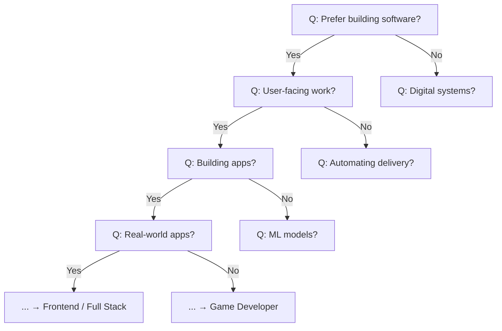
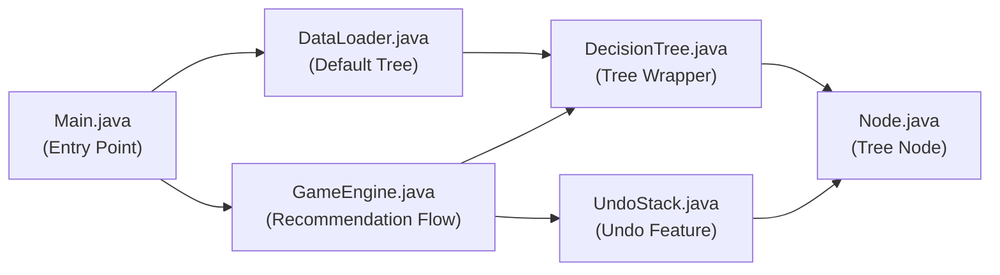

# 📖 The Career Path Oracle — คู่มืออธิบายการทำงานของโปรแกรม

## 1. ภาพรวมของโปรแกรม

**The Career Path Oracle** เป็นเครื่องมือแนะนำอาชีพด้านเทคโนโลยีแบบ Interactive Console Application ที่ใช้ **Binary Decision Tree** ในการนำทางผู้เล่นผ่านคำถาม Yes/No เพื่อแนะนำอาชีพที่เหมาะสม โปรแกรมมี 20 อาชีพ ครอบคลุมสาย Software, Infrastructure และ Hardware โดยแต่ละอาชีพมี description และ type (Uke/Seme)

### ฟีเจอร์หลักทั้งหมด

| ฟีเจอร์ | รายละเอียด |
|---------|-----------|
| 🎯 **แนะนำอาชีพ** | ถามคำถาม Yes/No ไล่ไปตาม Decision Tree จนถึงอาชีพที่เหมาะสม |
| ↩ **Undo (ย้อนกลับ)** | พิมพ์ `undo` หรือ `u` เพื่อกลับไปคำถามก่อนหน้า |
| 📊 **สรุปผลท้ายเกม** | แสดงจำนวนคำถามที่ตอบ, เส้นทางคำตอบ, และผลลัพธ์อาชีพ |
| 🏷️ **Uke/Seme Type** | แต่ละอาชีพมี tag ว่าเป็นสาย Uke (gentle, supportive) หรือ Seme (strong, leader) |

---

## 2. โครงสร้างข้อมูล (Data Structures) ที่ใช้ — 2 ชนิด

### 2.1 Binary Decision Tree (โครงสร้างหลัก)
- **Internal Node** = เก็บคำถาม Yes/No (เช่น "Do you prefer building software and writing code?")
- **Leaf Node** = เก็บชื่ออาชีพ + description + type (เช่น "Frontend Developer | Builds beautiful... | Uke")
- ไล่จาก Root → ถามคำถาม → Yes ไปลูกซ้าย / No ไปลูกขวา → จนถึง Leaf = คำแนะนำ



### 2.2 Custom Stack — UndoStack (ย้อนกลับ)
- ใช้ **Linked List** เป็นโครงสร้างภายใน (ไม่ใช้ `java.util.Stack`)
- ทุกครั้งที่ตอบคำถาม → `push()` Node ปัจจุบันเข้า Stack
- พิมพ์ `undo` → `pop()` เอา Node เก่ากลับมา แล้วถามใหม่

---

## 3. อธิบายแต่ละไฟล์และฟังก์ชันสำคัญ

---

### 3.1 [Node.java](file:///d:/KMUTT/1-2/CPE%20121/M3/Project/Node.java) — โหนดของ Binary Tree

> [!NOTE]
> เป็นหน่วยพื้นฐานของ Decision Tree ทุกโหนดเก็บข้อมูล 1 อย่าง (คำถามหรือชื่ออาชีพ)

| ฟังก์ชัน | หน้าที่ |
|---------|--------|
| `Node(String data)` | สร้าง question node (internal) เก็บคำถาม |
| `Node(String data, String description, String type)` | สร้าง career node (leaf) เก็บชื่ออาชีพ, description, Uke/Seme |
| `getData()` / `setData(String)` | อ่าน/เปลี่ยนข้อมูลของโหนด |
| `getYesNode()` / `setYesNode(Node)` | อ่าน/กำหนดลูกฝั่ง Yes |
| `getNoNode()` / `setNoNode(Node)` | อ่าน/กำหนดลูกฝั่ง No |
| `getDescription()` / `setDescription(String)` | อ่าน/กำหนด description ของอาชีพ |
| `getType()` / `setType(String)` | อ่าน/กำหนด type (Uke/Seme) |
| `isLeaf()` | คืน `true` ถ้าไม่มีลูก (= เป็นอาชีพ, ไม่ใช่คำถาม) |

**หลักการ:**
- ถ้า `isLeaf() == true` → โหนดนี้คืออาชีพ (เช่น "DevOps Engineer")
- ถ้า `isLeaf() == false` → โหนดนี้คือคำถาม (เช่น "Do you automate CI/CD?")

---

### 3.2 [DecisionTree.java](file:///d:/KMUTT/1-2/CPE%20121/M3/Project/DecisionTree.java) — จัดการ Binary Decision Tree

> [!NOTE]
> เป็น wrapper class ที่เก็บ root ของ Tree

| ฟังก์ชัน | หน้าที่ |
|---------|--------|
| `DecisionTree(Node root)` | สร้าง Tree โดยรับ root node |
| `getRoot()` / `setRoot(Node)` | อ่าน/กำหนด root ของ Tree |

---

### 3.3 [DataLoader.java](file:///d:/KMUTT/1-2/CPE%20121/M3/Project/DataLoader.java) — สร้าง Tree เริ่มต้น (20 อาชีพ)

> [!NOTE]
> สร้าง Decision Tree แบบ Hardcoded ที่มี 20 อาชีพ ความลึก 7-10 ระดับ

| ฟังก์ชัน | หน้าที่ |
|---------|--------|
| `loadInitialTree()` | สร้างและคืน DecisionTree ที่มี 20 อาชีพ |

#### โครงสร้างสาขาหลักของ Tree:

```
ROOT: "Prefer building software and writing code over managing infrastructure?"
├── YES → Software & Development (10 อาชีพ)
│   ├── User-facing Branch
│   │   ├── Frontend Developer [Uke]
│   │   ├── Full Stack Developer [Seme]
│   │   ├── Backend Developer [Seme]
│   │   ├── Data Engineer [Seme]
│   │   ├── Mobile Developer [Uke]
│   │   ├── QA / Test Automation Engineer [Uke]
│   │   ├── Game Developer [Seme]
│   │   └── Business Intelligence (BI) Developer [Uke]
│   │
│   └── Behind-the-scenes Branch
│       ├── AI / Machine Learning Engineer [Seme]
│       ├── Data Scientist [Uke]
│       ├── DevOps Engineer [Seme]
│       └── (+ Full Stack / Backend via alt paths)
│
└── NO → Infrastructure & Hardware (10 อาชีพ)
    ├── Digital Infrastructure Branch
    │   ├── Site Reliability Engineer (SRE) [Seme]
    │   ├── System Engineer / Administrator [Seme]
    │   ├── Cloud Engineer [Uke]
    │   ├── Network Engineer [Uke]
    │   ├── Cybersecurity Engineer / Pentester [Seme]
    │   └── Blockchain Engineer [Seme]
    │
    └── Physical/Hardware Branch
        ├── IoT Engineer [Uke]
        ├── Embedded Systems Engineer [Seme]
        └── Hardware Design Engineer [Seme]
```

**รวม 20 อาชีพ** ครบตามข้อกำหนด

---

### 3.4 [UndoStack.java](file:///d:/KMUTT/1-2/CPE%20121/M3/Project/UndoStack.java) — Stack สำหรับ Undo

> [!IMPORTANT]
> เขียนเองทั้งหมดโดยใช้ Linked List ภายใน **ไม่ใช้ java.util.Stack**

| ฟังก์ชัน | หน้าที่ |
|---------|--------|
| `push(Node node)` | เพิ่ม node ลงบน stack (เรียกก่อนเลื่อนไป child) |
| `pop()` | ดึง node บนสุดออก (เรียกเมื่อ user พิมพ์ undo) |
| `peek()` | ดู node บนสุดโดยไม่ลบ |
| `isEmpty()` | ตรวจว่า stack ว่างหรือไม่ |
| `clear()` | ล้าง stack ทั้งหมด |
| `getSize()` | คืนจำนวน element ใน stack |

#### ตัวอย่างการทำงาน Undo:
```
คำถาม 1: "Prefer building software?" → ตอบ yes → push(คำถาม 1)
คำถาม 2: "User-facing work?" → ตอบ no → push(คำถาม 2)
คำถาม 3: "Automating delivery?" → พิมพ์ undo!
  → pop() → กลับไปคำถาม 2: "User-facing work?"
```

---

### 3.5 [GameEngine.java](file:///d:/KMUTT/1-2/CPE%20121/M3/Project/GameEngine.java) — ศูนย์กลางการแนะนำอาชีพ

> [!NOTE]
> ไฟล์ที่ควบคุม flow ทั้งหมด ตั้งแต่ welcome จนถึง farewell

| ฟังก์ชัน | หน้าที่ |
|---------|--------|
| `start()` | **เมธอดหลัก** — แสดง Welcome → navigate → แสดงผล → สรุป → จบ |
| `printWelcome()` | พิมพ์แบนเนอร์ต้อนรับ + คำแนะนำการใช้งาน |
| `navigate()` | **นำทาง Tree** — ถามคำถาม, รับ input, undo, เลื่อนไปลูก Yes/No |
| `printResult(Node)` | แสดงอาชีพที่แนะนำ + description + type แบบ word-wrapped |
| `printWrapped(text, width, prefix)` | ตัดบรรทัดข้อความให้พอดีความกว้าง |
| `printSummary(Node)` | พิมพ์สรุปคำตอบทั้งหมด + ผลลัพธ์ |
| `shortenQuestion(String)` | ย่อคำถามให้สั้นลงสำหรับ summary |
| `saveAndExit()` | พิมพ์ข้อความลาก่อน |

#### Flow ของ start():
```
1. printWelcome()       → แสดง banner + instructions
2. navigate()           → ถาม Q1, Q2, Q3... จนถึง leaf
3. printResult(career)  → แสดงอาชีพที่แนะนำ + description
4. printSummary(career) → สรุปคำตอบทั้งหมด
5. saveAndExit()        → ข้อความลาก่อน
```

#### Flow ของ navigate():
```
1. เริ่มจาก root
2. วน loop ตราบที่ยังไม่ถึง leaf:
   - แสดงคำถาม (Q1. Q2. ...)
   - รับ input:
     • "yes"/"y" → push ลง stack, บันทึกคำตอบ, ไปลูก yes
     • "no"/"n"  → push ลง stack, บันทึกคำตอบ, ไปลูก no
     • "undo"/"u" → pop จาก stack กลับไปคำถามก่อนหน้า
     • อื่นๆ → แจ้งข้อผิดพลาด ถามใหม่
3. ถึง leaf → return career node
```

---

### 3.6 [Main.java](file:///d:/KMUTT/1-2/CPE%20121/M3/Project/Main.java) — จุดเริ่มต้นโปรแกรม

| ฟังก์ชัน | หน้าที่ |
|---------|--------|
| `main(String[] args)` | โหลด Tree จาก DataLoader → สร้าง GameEngine → เริ่มเกม |

#### Logic:
```java
DecisionTree careerTree = DataLoader.loadInitialTree();
GameEngine game = new GameEngine(careerTree);
game.start();
```

---

## 4. ตัวอย่างการใช้งานจริง

### Scenario A: เล่นจนได้ผลลัพธ์ ✓
```
==================================================
  Welcome to The Career Path Oracle
==================================================
I will recommend a tech career path for you!
Answer a series of yes/no questions about your
interests and preferences.

  Controls:
    yes / y  = Yes
    no  / n  = No
    undo / u = Go back to previous question

  Each career is tagged as:
    [Uke]  = the gentle, supportive type <3
    [Seme] = the strong, leader type <3
==================================================

  Q1. Do you prefer building software and writing code over managing infrastructure and hardware?
  >>> yes

  Q2. Do you enjoy creating things that users directly see and interact with on screen?
  >>> yes

  Q3. Are you more passionate about building interactive applications than analyzing data and reports?
  >>> yes

  Q4. Do you prefer developing real-world applications over creating video games?
  >>> yes

  Q5. Do you prefer working with web technologies (HTML, CSS, JavaScript) over native mobile platforms?
  >>> yes

  Q6. Do you enjoy building complex UIs with modern frameworks like React, Vue, or Angular?
  >>> yes

  Q7. Do you specialize in creating responsive, accessible web interfaces?
  >>> yes

  Q8. Do you focus mainly on the browser side, leaving server-side logic to others?
  >>> yes

  ==================================================
   YOUR RECOMMENDED CAREER PATH
  ==================================================

   >> Frontend Developer [Uke]

   About this career:
     Builds beautiful, responsive web interfaces
     using HTML, CSS, and JavaScript with modern
     frameworks like React or Vue. Focuses on user
     experience, accessibility, and performance
     in the browser.

  ==================================================
```

### Scenario B: ใช้ Undo ↩
```
  Q1. Do you prefer building software and writing code over managing infrastructure and hardware?
  >>> yes

  Q2. Do you enjoy creating things that users directly see and interact with on screen?
  >>> yes

  Q3. Are you more passionate about building interactive applications than analyzing data and reports?
  >>> undo
  << Back to previous question.

  Q2. Do you enjoy creating things that users directly see and interact with on screen?
  >>> no
  ...
```

### Summary ท้ายเกม 📊
```
  =================== SUMMARY ====================
  Questions answered: 8

  Your answers:
    1. [Y] Prefer building software and writing code over managing inf...
    2. [Y] Enjoy creating things that users directly see and interact ...
    3. [Y] More passionate about building interactive applications tha...
    4. [Y] Prefer developing real-world applications over creating vid...
    5. [Y] Prefer working with web technologies (HTML, CSS, JavaScript...
    6. [Y] Enjoy building complex UIs with modern frameworks like Reac...
    7. [Y] Specialize in creating responsive, accessible web interfaces?
    8. [Y] Focus mainly on the browser side, leaving server-side logic...

  Result: Frontend Developer
  Type  : Uke
  ==================================================

  Thanks for using The Career Path Oracle! Goodbye.
```

---

## 5. วิธีคอมไพล์และรัน

```bash
javac *.java
java Main
```

> [!TIP]
> โปรแกรมจะโหลด Decision Tree จาก DataLoader ที่มี 20 อาชีพ เล่นได้เลยทันทีไม่ต้องเตรียมไฟล์อะไร

---

## 6. แผนผังความสัมพันธ์ของไฟล์



---

## 7. สรุป Data Structures ที่ใช้ (ตามข้อกำหนด ≥ 2)

| # | Data Structure | ไฟล์ | วัตถุประสงค์ |
|---|---------------|------|-------------|
| 1 | **Binary Decision Tree** | Node.java + DecisionTree.java + DataLoader.java | โครงสร้างหลักสำหรับคำถาม-คำตอบ แนะนำอาชีพ |
| 2 | **Custom Stack (Linked List)** | UndoStack.java | ย้อนกลับคำตอบ (Undo) ระหว่างเล่น |

> [!IMPORTANT]
> ทั้ง 2 โครงสร้างเขียนเอง 100% **ไม่มีการใช้ java.util.Stack, java.util.LinkedList, java.util.ArrayList** หรือ Collection class ใดๆ
