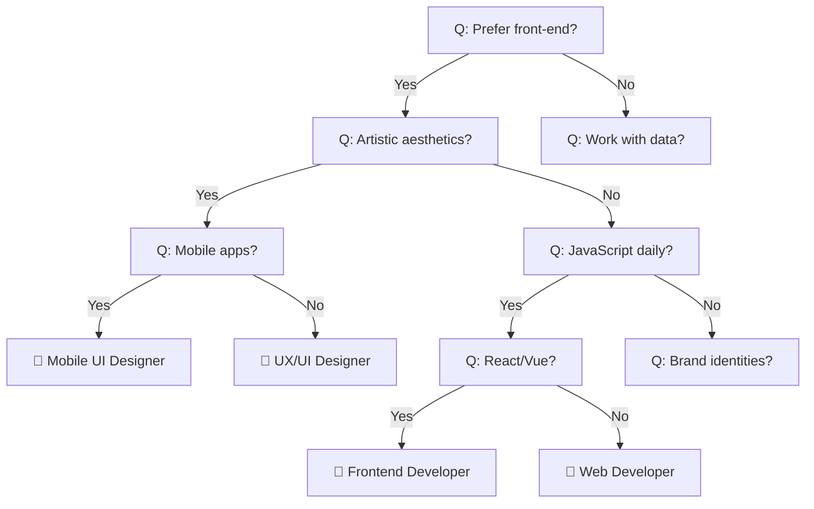
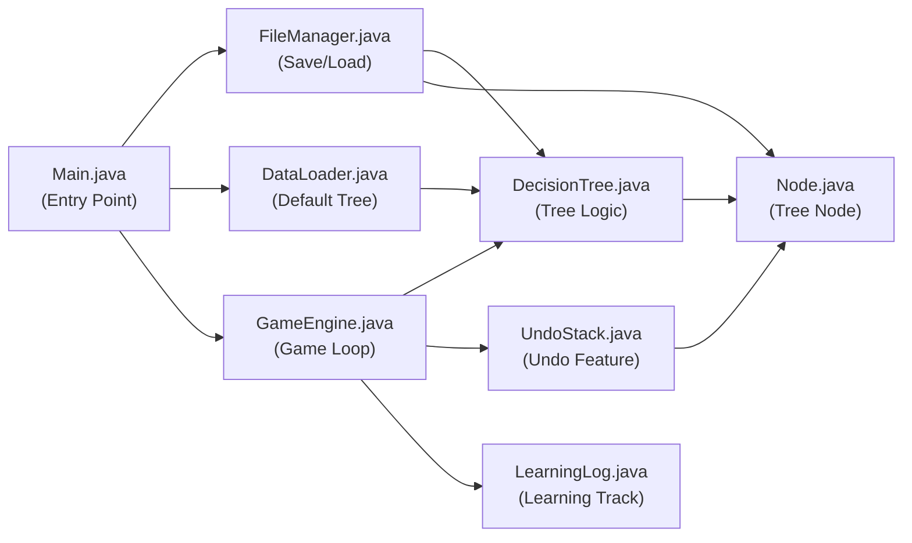

# 📖 The Career Path Oracle — คู่มืออธิบายการทำงานของโปรแกรม

## 1. ภาพรวมของโปรแกรม

**The Career Path Oracle** เป็นเกมทายอาชีพด้านเทคโนโลยีแบบ Interactive Console Game ที่ใช้ **Binary Decision Tree** ในการนำทางผู้เล่นผ่านคำถาม Yes/No เพื่อทำนายอาชีพที่เหมาะสม โปรแกรมสามารถ **เรียนรู้อาชีพใหม่** จากผู้เล่นได้ และ **บันทึกความรู้** ลงไฟล์เพื่อใช้ในครั้งถัดไป

### ฟีเจอร์หลักทั้งหมด

| ฟีเจอร์ | รายละเอียด |
|---------|-----------|
| 🎯 **ทายอาชีพ** | ถามคำถาม Yes/No ไล่ไปตาม Decision Tree จนทายอาชีพได้ |
| ↩ **Undo (ย้อนกลับ)** | พิมพ์ `undo` หรือ `u` เพื่อกลับไปคำถามก่อนหน้า |
| 🧠 **เรียนรู้อาชีพใหม่** | ถ้าทายผิด ผู้เล่นสอนอาชีพใหม่ให้โปรแกรม → Tree ขยายตัวอัตโนมัติ |
| 💾 **บันทึก/โหลดจากไฟล์** | บันทึก Tree ลง `careers.txt` และโหลดกลับมาใช้ใหม่ได้ |
| 📊 **สรุปผลท้ายเกม** | แสดงจำนวนรอบ, ทายถูก/ผิด, เส้นทางแต่ละรอบ, อาชีพใหม่ที่เรียนรู้ |
| 🔄 **เล่นซ้ำได้** | จบแต่ละรอบแล้วเลือกเล่นต่อหรือจบเกมได้ |

---

## 2. โครงสร้างข้อมูล (Data Structures) ที่ใช้ — 3 ชนิด

### 2.1 Binary Decision Tree (โครงสร้างหลัก)
- **Internal Node** = เก็บคำถาม Yes/No (เช่น "Do you prefer front-end?")
- **Leaf Node** = เก็บชื่ออาชีพ (เช่น "Frontend Developer (React/Vue)")
- ไล่จาก Root → ถามคำถาม → Yes ไปลูกซ้าย / No ไปลูกขวา → จนถึง Leaf = คำตอบ



### 2.2 Custom Stack — UndoStack (ย้อนกลับ)
- ใช้ **Linked List** เป็นโครงสร้างภายใน (ไม่ใช้ `java.util.Stack`)
- ทุกครั้งที่ตอบคำถาม → `push()` Node ปัจจุบันเข้า Stack
- พิมพ์ `undo` → `pop()` เอา Node เก่ากลับมา แล้วถามใหม่

### 2.3 Custom Singly Linked List — LearningLog (บันทึกการเรียนรู้)
- ทุกครั้งที่ผู้เล่นสอนอาชีพใหม่ → เพิ่ม entry ลง Linked List
- ท้ายเกมจะพิมพ์รายการอาชีพใหม่ทั้งหมดที่เรียนรู้ในเซสชันนี้

---

## 3. อธิบายแต่ละไฟล์และฟังก์ชันสำคัญ

---

### 3.1 [Node.java](file:///d:/KMUTT/1-2/CPE%20121/M3/Project/Node.java) — โหนดของ Binary Tree

> [!NOTE]
> เป็นหน่วยพื้นฐานของ Decision Tree ทุกโหนดเก็บข้อมูล 1 อย่าง (คำถามหรือชื่ออาชีพ)

| ฟังก์ชัน | หน้าที่ |
|---------|--------|
| `Node(String data)` | สร้างโหนดใหม่ เก็บ data, ยังไม่มีลูก |
| `getData()` / `setData(String)` | อ่าน/เปลี่ยนข้อมูลของโหนด |
| `getYesNode()` / `setYesNode(Node)` | อ่าน/กำหนดลูกฝั่ง Yes |
| `getNoNode()` / `setNoNode(Node)` | อ่าน/กำหนดลูกฝั่ง No |
| `isLeaf()` | คืน `true` ถ้าไม่มีลูก (= เป็นอาชีพ, ไม่ใช่คำถาม) |

**หลักการ:**
- ถ้า `isLeaf() == true` → โหนดนี้คืออาชีพ (เช่น "DevOps Engineer")
- ถ้า `isLeaf() == false` → โหนดนี้คือคำถาม (เช่น "Do you automate CI/CD?")

---

### 3.2 [DecisionTree.java](file:///d:/KMUTT/1-2/CPE%20121/M3/Project/DecisionTree.java) — จัดการ Binary Decision Tree

> [!NOTE]
> เป็น wrapper class ที่เก็บ root ของ Tree และมีเมธอดสำหรับ Dynamic Learning

| ฟังก์ชัน | หน้าที่ |
|---------|--------|
| `DecisionTree(Node root)` | สร้าง Tree โดยรับ root node |
| `getRoot()` / `setRoot(Node)` | อ่าน/กำหนด root ของ Tree |
| `insertNewKnowledge(...)` | **เมธอดหลักสำหรับการเรียนรู้** — แปลง leaf เป็น question node |

#### ⭐ insertNewKnowledge — หัวใจของการเรียนรู้

```
ก่อน: [Web Developer]  ← leaf node

ผู้เล่นสอน: อาชีพจริงคือ "Game Developer"
คำถามที่แยกได้: "Do you make interactive 3D experiences?"
ตอบ yes → Game Developer

หลัง:
         [Do you make interactive 3D experiences?]
        /                                        \
  [Game Developer]                         [Web Developer]
   (yes branch)                             (no branch)
```

**Parameters:**
- `currentLeaf` — leaf node ที่ทายผิด (เช่น "Web Developer")
- `newCareer` — อาชีพที่ถูกต้อง (เช่น "Game Developer")
- `newQuestion` — คำถามที่แยก 2 อาชีพนี้ออกจากกัน
- `isYesAnswerForNew` — ถ้า `true` → ตอบ yes ได้อาชีพใหม่, ตอบ no ได้อาชีพเดิม

---

### 3.3 [DataLoader.java](file:///d:/KMUTT/1-2/CPE%20121/M3/Project/DataLoader.java) — สร้าง Tree เริ่มต้น (30 อาชีพ)

> [!NOTE]
> สร้าง Decision Tree แบบ Hardcoded สำหรับใช้ครั้งแรกที่ยังไม่มีไฟล์ `careers.txt`

| ฟังก์ชัน | หน้าที่ |
|---------|--------|
| `loadInitialTree()` | สร้างและคืน DecisionTree ที่มี 30 อาชีพ |

#### โครงสร้างสาขาหลักของ Tree:

```
ROOT: "Prefer front-end over back-end?"
├── YES → Frontend/Design Branch (6 อาชีพ)
│   ├── Mobile UI Designer
│   ├── UX/UI Designer
│   ├── Frontend Developer (React/Vue)
│   ├── Web Developer
│   ├── Graphic Designer
│   └── Product Designer
│
└── NO → Back-end/Other Branch
    ├── Data Branch (5 อาชีพ)
    │   ├── AI Research Scientist
    │   ├── Machine Learning Engineer
    │   ├── Data Analyst / BI Developer
    │   ├── Database Administrator
    │   └── Data Engineer
    │
    └── Engineering Branch (19 อาชีพ)
        ├── DevOps Engineer
        ├── Cloud Engineer / SysAdmin
        ├── iOS Developer
        ├── Android Developer
        ├── Back-End Developer
        ├── Full-Stack Developer
        ├── Cybersecurity Engineer
        ├── QA Engineer / SDET
        ├── IT Project Manager
        ├── Embedded Systems Engineer
        ├── Technical Support Engineer
        ├── Blockchain Developer
        ├── Game Developer
        ├── AR/VR Developer
        ├── Cloud Architect
        ├── Technical Writer
        ├── Scrum Master
        ├── Site Reliability Engineer (SRE)
        └── Solutions Architect
```

**รวม 30 อาชีพ** ครบตามข้อกำหนด

---

### 3.4 [FileManager.java](file:///d:/KMUTT/1-2/CPE%20121/M3/Project/FileManager.java) — บันทึก/โหลด Tree จากไฟล์

> [!NOTE]
> ใช้ Pre-order Traversal ในการ Serialize/Deserialize Tree ลงไฟล์ `careers.txt`

| ฟังก์ชัน | หน้าที่ |
|---------|--------|
| `hasSavedData()` | ตรวจว่ามีไฟล์ `careers.txt` อยู่หรือไม่ |
| `saveTree(Node root)` | บันทึก Tree ทั้งต้นลงไฟล์ |
| `loadTree()` | อ่านไฟล์แล้วสร้าง Tree กลับมา |
| `writePreOrder(Node, FileWriter)` | เขียนแบบ Pre-order (recursive) |
| `readPreOrder(Scanner)` | อ่านแบบ Pre-order (recursive) |

#### รูปแบบไฟล์ careers.txt:
```
Q: Do you prefer working with visual interfaces (front-end) over back-end logic?
Q: Do you care more about artistic aesthetics than technical precision?
Q: Do you design mobile apps specifically?
A: Mobile UI Designer
A: UX/UI Designer
Q: Do you enjoy writing JavaScript and CSS daily?
...
```

- บรรทัดที่ขึ้นต้นด้วย `Q:` = คำถาม (Internal Node)
- บรรทัดที่ขึ้นต้นด้วย `A:` = อาชีพ (Leaf Node)
- ลำดับเป็น **Pre-order** (Root → Yes-subtree → No-subtree)

---

### 3.5 [UndoStack.java](file:///d:/KMUTT/1-2/CPE%20121/M3/Project/UndoStack.java) — Stack สำหรับ Undo

> [!IMPORTANT]
> เขียนเองทั้งหมดโดยใช้ Linked List ภายใน **ไม่ใช้ java.util.Stack**

| ฟังก์ชัน | หน้าที่ |
|---------|--------|
| `push(Node node)` | เพิ่ม node ลงบน stack (เรียกก่อนเลื่อนไป child) |
| `pop()` | ดึง node บนสุดออก (เรียกเมื่อ user พิมพ์ undo) |
| `peek()` | ดู node บนสุดโดยไม่ลบ |
| `isEmpty()` | ตรวจว่า stack ว่างหรือไม่ |
| `clear()` | ล้าง stack ทั้งหมด (เรียกตอนเริ่มรอบใหม่) |
| `getSize()` | คืนจำนวน element ใน stack |

#### ตัวอย่างการทำงาน Undo:
```
คำถาม 1: "Prefer front-end?" → ตอบ yes → push(คำถาม 1)
คำถาม 2: "Artistic aesthetics?" → ตอบ no → push(คำถาม 2)
คำถาม 3: "JavaScript daily?" → พิมพ์ undo!
  → pop() → กลับไปคำถาม 2: "Artistic aesthetics?"
```

---

### 3.6 [LearningLog.java](file:///d:/KMUTT/1-2/CPE%20121/M3/Project/LearningLog.java) — Linked List บันทึกการเรียนรู้

> [!IMPORTANT]
> เขียนเองทั้งหมดโดยใช้ Singly Linked List **ไม่ใช้ java.util.LinkedList**

| ฟังก์ชัน | หน้าที่ |
|---------|--------|
| `addEntry(newCareer, oldCareer, question, answeredYes)` | เพิ่ม entry ท้ายลิสต์ |
| `printLog()` | พิมพ์รายการทั้งหมดแบบ formatted |
| `isEmpty()` | ตรวจว่าลิสต์ว่างหรือไม่ |
| `getSize()` | คืนจำนวน entry |

#### ตัวอย่าง Output ของ printLog():
```
  [1] Game Developer  |  "Do you make interactive 3D experiences?"
        |  yes → Game Developer,  no → AR/VR Developer
```

---

### 3.7 [GameEngine.java](file:///d:/KMUTT/1-2/CPE%20121/M3/Project/GameEngine.java) — ศูนย์กลาง Game Loop

> [!NOTE]
> ไฟล์ที่ใหญ่ที่สุด เป็นตัวควบคุมการเล่นเกมทั้งหมด

| ฟังก์ชัน | หน้าที่ |
|---------|--------|
| `start()` | **เมธอดหลัก** — แสดง Welcome, เข้า game loop, จบด้วย summary + save |
| `printWelcome()` | พิมพ์แบนเนอร์ต้อนรับ |
| `playRound()` | **เล่น 1 รอบ** — ถามคำถาม, undo, ทาย, เรียนรู้ |
| `extractKeyword(String)` | สกัดคำสำคัญจากคำถามเพื่อใช้แสดงเส้นทาง |
| `printSummary()` | พิมพ์สรุปผลท้ายเกม |
| `saveAndExit()` | บันทึก Tree + ข้อความลาก่อน |

#### Flow ของ start():
```
1. printWelcome()
2. loop:
   a. playRound()
   b. ถาม "Play again?"
      → yes: วนรอบใหม่
      → no: ออก loop
3. printSummary()
4. saveAndExit()
```

#### Flow ของ playRound():
```
1. เริ่มจาก root, ล้าง undoStack
2. วน loop ตราบที่ยังไม่ถึง leaf:
   - แสดงคำถาม
   - รับ input:
     • "yes"/"y" → push ลง stack, ไปลูก yes
     • "no"/"n"  → push ลง stack, ไปลูก no
     • "undo"/"u" → pop จาก stack กลับไปคำถามก่อนหน้า
     • อื่นๆ → แจ้งข้อผิดพลาด ถามใหม่
3. ถึง leaf → ทายอาชีพ:
   • ทายถูก → correctGuesses++
   • ทายผิด → ถามอาชีพจริง + คำถามแยก → insertNewKnowledge() + addEntry() ใน LearningLog
4. บันทึกเส้นทาง (path) ของรอบนี้
```

---

### 3.8 [Main.java](file:///d:/KMUTT/1-2/CPE%20121/M3/Project/Main.java) — จุดเริ่มต้นโปรแกรม

| ฟังก์ชัน | หน้าที่ |
|---------|--------|
| `main(String[] args)` | โหลด Tree → สร้าง GameEngine → เริ่มเกม |

#### Logic:
```java
if (FileManager.hasSavedData()) {
    // มีไฟล์ careers.txt → โหลดจากไฟล์
    careerTree = FileManager.loadTree();
} else {
    // ไม่มีไฟล์ → ใช้ DataLoader สร้าง Tree เริ่มต้น 30 อาชีพ
    careerTree = DataLoader.loadInitialTree();
}
GameEngine game = new GameEngine(careerTree);
game.start();
```

---

## 4. ตัวอย่างการใช้งานจริง

### Scenario A: ทายถูกตั้งแต่แรก ✓
```
--- Round 1 ---
Do you prefer working with visual interfaces (front-end) over back-end logic? (yes/no/undo): yes
Do you care more about artistic aesthetics than technical precision? (yes/no/undo): no
Do you enjoy writing JavaScript and CSS daily? (yes/no/undo): yes
Do you work with frameworks like React or Vue? (yes/no/undo): yes

Is the career you're thinking of [Frontend Developer (React/Vue)]? (yes/no): yes

✓ Correct! I guessed your career!
```

### Scenario B: ใช้ Undo ↩
```
Do you prefer working with visual interfaces (front-end) over back-end logic? (yes/no/undo): yes
Do you care more about artistic aesthetics than technical precision? (yes/no/undo): yes
Do you design mobile apps specifically? (yes/no/undo): undo
↩ Undone! Back to previous question.
Do you care more about artistic aesthetics than technical precision? (yes/no/undo): no
...
```

### Scenario C: สอนอาชีพใหม่ 🧠
```
Is the career you're thinking of [Web Developer]? (yes/no): no

✗ I was wrong!
What career were you thinking of? WordPress Developer
What is a yes/no question that distinguishes [WordPress Developer] from [Web Developer]? Do you specialize in WordPress and CMS platforms?
For [WordPress Developer], is the answer to that question yes or no? yes

✓ Thanks! I've learned about [WordPress Developer].
```

### Session Summary ท้ายเกม 📊
```
==================== SESSION SUMMARY ====================
Total rounds played : 3
Correct guesses     : 2 ✓
Wrong guesses       : 1 ✗

Path taken each round:
  Round 1: visual→yes, aesthetic→no, javascript→yes, framework→yes  ✓ Frontend Developer (React/Vue)
  Round 2: visual→no, data→yes, mlModels→no, visualize→yes  ✓ Data Analyst / BI Developer
  Round 3: visual→no, data→no, infra→no, coreLogic→no, ...  ✗ Web Developer (learned: WordPress Developer)

New knowledge learned today:
  [1] WordPress Developer  |  "Do you specialize in WordPress and CMS platforms?"
        |  yes → WordPress Developer,  no → Web Developer
=========================================================
Knowledge base saved to careers.txt ✓
Thanks for playing! Goodbye.
```

---

## 5. วิธีคอมไพล์และรัน

```bash
javac *.java
java Main
```

> [!TIP]
> ครั้งแรกที่รันจะใช้ DataLoader (30 อาชีพ) → หลังจากเล่นจบจะสร้าง `careers.txt` → ครั้งต่อไปจะโหลดจากไฟล์โดยอัตโนมัติ (รวมอาชีพใหม่ที่เรียนรู้ด้วย)

---

## 6. แผนผังความสัมพันธ์ของไฟล์



---

## 7. สรุป Data Structures ที่ใช้ (ตามข้อกำหนด ≥ 2)

| # | Data Structure | ไฟล์ | วัตถุประสงค์ |
|---|---------------|------|-------------|
| 1 | **Binary Decision Tree** | Node.java + DecisionTree.java + DataLoader.java | โครงสร้างหลักสำหรับคำถาม-คำตอบ ทายอาชีพ |
| 2 | **Custom Stack (Linked List)** | UndoStack.java | ย้อนกลับคำตอบ (Undo) ระหว่างเล่น |
| 3 | **Custom Singly Linked List** | LearningLog.java | บันทึกอาชีพใหม่ที่เรียนรู้ในแต่ละเซสชัน |

> [!IMPORTANT]
> ทั้ง 3 โครงสร้างเขียนเอง 100% **ไม่มีการใช้ java.util.Stack, java.util.LinkedList, java.util.ArrayList** หรือ Collection class ใดๆ
